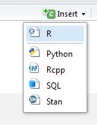
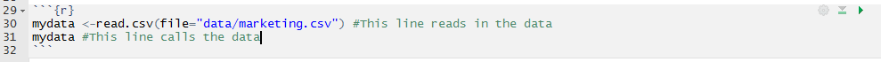

# notebooks
Labs and material part of the Business Analytics course at Quinlan School of Business

###  About

An R Notebook is an R Markdown document with chunks that can be executed independently and interactively, with output visible immediately beneath the input. R Notebooks are a method of literate programming that allows for direct interaction with R while producing a reproducible document with publication-quality output. 

A notebook for this class will consist of comments and directions followed by a chunk of code that can be ran independently in order for students to see the examples and follow along with the lessons.

### SetUp

To use R Notebooks, first R Studio must be opened. To create an R Notebook in RStudio, go to File -> New File -> R Notebook. In this course though, the notebooks will be created and prior to the class and students will edit them as the lab proceeds.

Typically a data set or notebook will be downloaded and it is important to set this folder as the working directory for the project prior to any coding. This can be done by going to Session -> Set Working Directory -> To Source File Location

### Header

The header is the very first few lines of code that give important information about the document. It is essential to edit this information everytime to ensure you are credited for your work and so people looking at your code know when and where it is coming from. 

### Inserting Chunks of Code

Notebook chunks can be inserted quickly using the keyboard shortcut Ctrl + Alt + I (OS X: Cmd + Option + I), or via the Insert command in the editor toolbar found at the top.

A chunk of empty code looks like this in the notebook before it is published:

It will always begin with they \`\`\` symbol followed by the `{r}` and ending with the \`\`\`. In this light grey box, you can code after the `{r}` and before the second \`\`\` symbol.  You can insert as many chunks of code as you would like as it is user preference. Typically, in an R Notebook, we aspire to have one output per chunk of code. If there will be more than one output, it is best to split the code. 

### Executing Code

In order to run the code, you have several options.

1. Use the  Run Chunk command  or Ctrl + Shift * Enter (OS X: Cmd + Shift + Enter) to run the current chunk.

2. Press Ctrl + Enter (OS X: Cmd + Enter) to run just the current statement. Running a single statement is much like running an entire chunk consisting only of that statement.

3. Use the Run All and Run Previous commands to run a batch of chunks found at the very top. 

#### Example Executing Code

After downloading a data set, we must read the data in. So, create an R code chunk in the R Notebook and write the code to read in the file. To make sure the file is read correctly, run the chunk. The code should look something like this. 

The green triangle with the red square around button is the 'run' button. If selected, this button runs the code. If we push it, we should obtain the following result. 

This is the output. If the output is not what you want, or if there is an error, you can simply go back to the code chunk, edit the code, and rerun it. 

### Errors

When coding, there are often small errors that are made. With R Notebooks, the message will display exactly what line your error is on, which allows you to fix it. 

In the example, below we see that the error is made because we forgot to set the working directory. This is a very common mistake and as a programmer, we will learn to identify these errors quickly. 

### Comments
When working on a lab, it is important to leave comments within your code to understand what you are doing when you refer to it later. A comment is made in the grey code chunk box by putting a "\#" symbol in front of text. This is what a comment will look like:

### Overall Impact

R Notebooks are revolutionary as they allow students to edit within the file and see the changes that are made with the output immediately without have to run the entire code. Please refer to this guide or the instructor with other questions.

source: [http://rmarkdown.rstudio.com/r_notebooks.html](http://rmarkdown.rstudio.com/r_notebooks.html)
