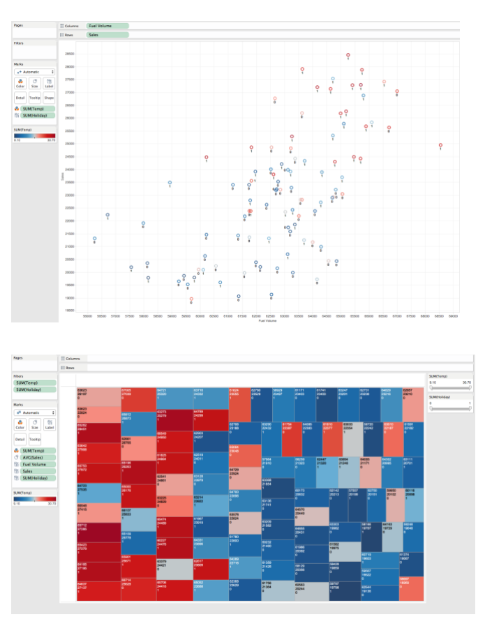

### About

In this section, we will be using Tableau to learn concepts on data outliers, seasonality effect, and the relationships and impacts. 

### Setup

Log onto Tableau and download the 'bsad_lab09' file. It will have the EuroStore.xls file. Connect/Import the data EuroStore.xls into TableauGet familiar with the data and what each column represents.

----------

### Task 1

In a new Tableau sheet
  A. Plot Sales (Rows) versus Week (Columns). Switch from SUM(Sales) to Dimension. Observations?
  B. Switch from SUM(Sales) to Average AVC(Sales). Observations?
  C. Replace Sales with Temp.  Adjust for the outliers. 
  D. Add Temp to the Color scale.  Adjust the color legend to be more reflective of hot and cold temperature.          Observations? 
  E. How would you combine Sales, Week, and Temperature in one plot? Observations?
  

----------

### Task 2

In a new Tableau sheet
  A. Plot Sales (Rows) versus TV (Columns). Observations?
  B. Overlay Radio to previous plot using Size. Observations?
  
In a separate sheet
  A. Plot Sales versus Fuel Volume. Observations?
  B. Add Fuel Prices using Size. Observations?
  C. Overlay Temperature using Color. Observations?
  D. Overlay Holiday using Label. Observations?
  
In a separate sheet
  E. Repeat using a Tree Map to best show the combined effect of Sales, Fuel Volume, Temp, and Holiday. A sample view is   shown on back page
  F. Consider using the Quick Filter on Holiday and Temp to isolate and better view the impact. You can have more than     one filter at a time.
  G. Summarize your final conclusions on what you think most affect Sales and under what conditions.
  
  
Copy and paste your results from both tasks below. They should look similar to this: 

